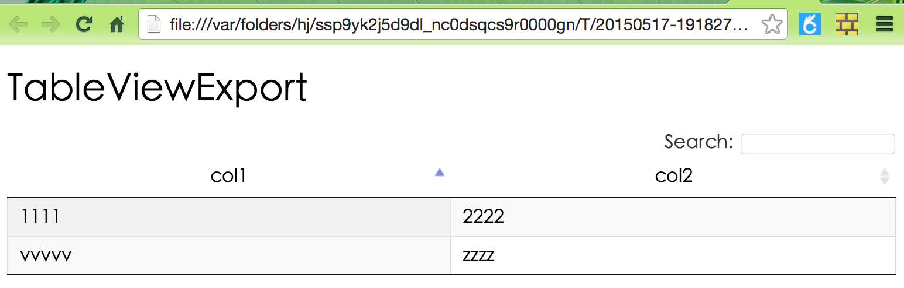
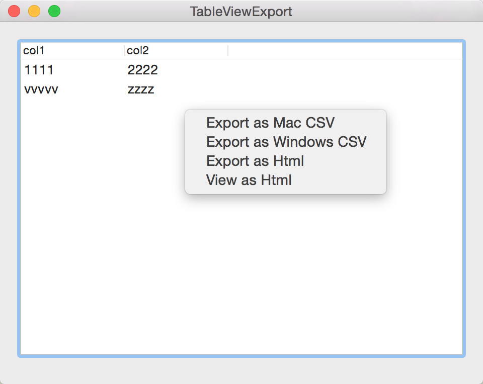

# NSTableView export csv orhtml
===================

NSTableView usually is used to display result set.
Sometimes I want to export to save as a file.
csv and html are common format.
So I write a subclass of NSMenu. It support to export a cell-based
NSTableView to csv or html or just view as html on browser.

----------


Use
-------------

Just one line code

```
[self.tableView setMenu:[[ExportMenu alloc] initWithTableView:self.tableView]]
```

> **ScreenShot:**
> </img>
> </img>